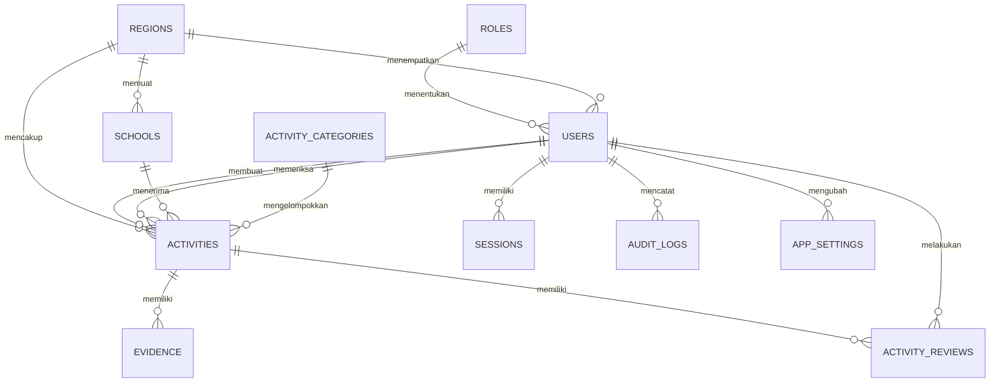

# Rencana Struktur Database Sistem Informasi Kegiatan Dapodik UPTD Tekkomdik

**Status:** Draft
**Database engine:** Turso dengan SQLite/libSQL
**Aplikasi:** SI Kinerja — Sistem Informasi Kegiatan Pelayanan Dapodik
**Cakupan MVP:** 4 wilayah, 10–16 pengguna

## 1. Tujuan Struktur Database

Struktur database dirancang untuk:

- menyimpan master wilayah, sekolah, pengguna, dan kategori kegiatan;
- menyimpan kegiatan pelayanan Dapodik beserta nama guru/konsultan;
- menyimpan metadata bukti yang berada di Google Drive;
- mendukung pembatasan data berdasarkan peran dan wilayah;
- mendukung alur pemeriksaan oleh Kepala tanpa penilaian formal atau skor;
- menyediakan riwayat pemeriksaan dan audit perubahan;
- mendukung dashboard, pencarian, filter, dan laporan.

Database **tidak menyimpan nilai kinerja, bobot KPI, target individu, ranking, atau hasil penilaian formal** karena fungsi utama aplikasi adalah pencatatan dan pemantauan kegiatan.

## 2. Keputusan Desain

### 2.1 Aturan Dasar

- Setiap koordinator dan anggota hanya memiliki satu wilayah.
- Admin dan Kepala memiliki cakupan global seluruh wilayah.
- Koordinator dan Anggota hanya dapat melihat atau mengubah data sesuai aturan perannya.
- Sekolah harus berada pada wilayah yang sama dengan kegiatan.
- Nama guru/konsultan wajib dicatat pada setiap kegiatan.
- Kegiatan yang dikirim harus memiliki minimal satu bukti yang tersedia di Google Drive.
- Data yang sudah diperiksa tidak dihapus permanen; koreksi dilakukan dengan status dan riwayat yang jelas.
- Data biner tidak disimpan di Turso. Turso hanya menyimpan metadata dan `driveFileId`.

### 2.2 Konvensi Data

| Aspek | Keputusan |
|---|---|
| Primary key | `TEXT` berisi UUID yang dibuat aplikasi |
| Nama tabel | `snake_case` dan bentuk jamak |
| Timestamp | `TEXT` ISO 8601 dalam UTC |
| Waktu kegiatan | ISO 8601 beserta offset zona waktu; default `Asia/Jakarta` |
| Boolean | `INTEGER` dengan nilai `0` atau `1` |
| Status | Kode `TEXT` dengan `CHECK`, bukan enum database |
| Soft delete | `deleted_at` atau `is_active`; referensi tidak dihapus permanen |
| Pencarian | Query terparameter; `LIKE` untuk MVP |
| JSON | `TEXT` dengan validasi aplikasi bila diperlukan |
| Boolean/hash | Password dan token hanya disimpan dalam bentuk aman |

### 2.3 Aturan Penghapusan

- `regions`, `schools`, `activity_categories`, dan `users` tidak dihapus permanen jika sudah direferensikan.
- Data master dinonaktifkan menggunakan `is_active = 0` bila tidak digunakan lagi.
- `activities` yang sudah berstatus `checked` tidak dapat dihapus permanen.
- `evidence` menggunakan status `deleted` dan `deleted_at` agar metadata historis tetap tersedia.
- Penghapusan logika selalu menghasilkan `audit_logs`.

## 3. Daftar Tabel

| Tabel | Fungsi | Relasi utama |
|---|---|---|
| `roles` | Daftar peran pengguna | `users` |
| `regions` | Data wilayah kerja | `users`, `schools`, `activities` |
| `users` | Akun, peran, dan wilayah pengguna | `activities`, `sessions`, `audit_logs` |
| `schools` | Data sekolah yang dilayani | `regions`, `activities` |
| `activity_categories` | Kategori kegiatan pelayanan | `activities` |
| `activities` | Catatan kegiatan utama | Banyak tabel melalui foreign key |
| `evidence` | Metadata bukti di Google Drive | `activities` |
| `activity_reviews` | Riwayat pemeriksaan oleh Kepala | `activities`, `users` |
| `sessions` | Sesi login yang dapat dicabut | `users` |
| `audit_logs` | Jejak perubahan penting | `users` sebagai aktor |
| `app_settings` | Konfigurasi non-rahasia aplikasi | `users` sebagai pemberi perubahan |

## 4. Diagram Relasi



`activities.region_id` disimpan pada kegiatan meskipun wilayah dapat diperoleh dari pengguna. Kolom ini mempercepat kueri dashboard dan menyediakan salinan wilayah ketika struktur pengguna berubah. Setiap perubahan wilayah harus dibatasi dan diaudit.

## 5. Struktur Tabel

### 5.1 `roles`

Menyimpan empat peran yang sudah ditetapkan.

| Kolom | Tipe | Aturan |
|---|---|---|
| `id` | TEXT | Primary key |
| `code` | TEXT | Wajib, unik: `admin`, `kepala`, `koordinator`, `anggota` |
| `name` | TEXT | Wajib |
| `description` | TEXT | Opsional |
| `is_system` | INTEGER | Default `1`; peran sistem tidak dapat dihapus |
| `created_at` | TEXT | Wajib |
| `updated_at` | TEXT | Wajib |

Nilai awal tabel `roles`:

| Code | Label |
|---|---|
| `admin` | Admin |
| `kepala` | Kepala |
| `koordinator` | Koordinator Wilayah |
| `anggota` | Anggota Wilayah |

### 5.2 `regions`

Menyimpan empat wilayah kerja.

| Kolom | Tipe | Aturan |
|---|---|---|
| `id` | TEXT | Primary key |
| `code` | TEXT | Wajib, unik |
| `name` | TEXT | Wajib |
| `description` | TEXT | Opsional |
| `is_active` | INTEGER | Default `1` |
| `created_at` | TEXT | Wajib |
| `updated_at` | TEXT | Wajib |
| `deleted_at` | TEXT | Nullable |

Wilayah tidak dihapus permanen karena menjadi referensi kegiatan dan pengguna.

### 5.3 `users`

Menyimpan akun aplikasi.

| Kolom | Tipe | Aturan |
|---|---|---|
| `id` | TEXT | Primary key |
| `role_id` | TEXT | Foreign key ke `roles.id` |
| `region_id` | TEXT | Foreign key ke `regions.id`; nullable hanya untuk Admin dan Kepala |
| `name` | TEXT | Wajib |
| `email` | TEXT | Wajib, unik, case-insensitive |
| `password_hash` | TEXT | Wajib; tidak pernah menyimpan password biasa |
| `position` | TEXT | Opsional |
| `phone` | TEXT | Opsional |
| `is_active` | INTEGER | Default `1` |
| `last_login_at` | TEXT | Nullable |
| `created_at` | TEXT | Wajib |
| `updated_at` | TEXT | Wajib |
| `deleted_at` | TEXT | Nullable |

Aturan bisnis:

- `koordinator` dan `anggota` wajib memiliki `region_id`.
- `admin` dan `kepala` dapat memiliki `region_id` kosong karena memiliki cakupan global.
- Mengubah `deleted_at` tidak otomatis mengaktifkan kembali akun; status aktif harus diperiksa saat login.
- Perubahan peran atau wilayah wajib menghasilkan audit log.

### 5.4 `schools`

Menyimpan master sekolah yang dapat dipilih pada kegiatan.

| Kolom | Tipe | Aturan |
|---|---|---|
| `id` | TEXT | Primary key |
| `region_id` | TEXT | Foreign key ke `regions.id` |
| `name` | TEXT | Wajib |
| `npsn` | TEXT | Opsional; unik jika diisi |
| `address` | TEXT | Opsional |
| `is_active` | INTEGER | Default `1` |
| `created_at` | TEXT | Wajib |
| `updated_at` | TEXT | Wajib |
| `deleted_at` | TEXT | Nullable |

Constraint yang disarankan:

- unique komposit `(region_id, name)` dengan perbandingan case-insensitive;
- unique `npsn` untuk nilai yang tidak kosong;
- composite key `(id, region_id)` untuk memastikan sekolah dan wilayah pada `activities` selalu cocok.

### 5.5 `activity_categories`

Menyimpan jenis kegiatan pelayanan.

| Kolom | Tipe | Aturan |
|---|---|---|
| `id` | TEXT | Primary key |
| `code` | TEXT | Wajib, unik |
| `name` | TEXT | Wajib |
| `description` | TEXT | Opsional |
| `sort_order` | INTEGER | Default `0` |
| `is_active` | INTEGER | Default `1` |
| `created_at` | TEXT | Wajib |
| `updated_at` | TEXT | Wajib |
| `deleted_at` | TEXT | Nullable |

Kategori dapat diubah oleh Admin, tetapi kategori yang sudah digunakan tidak dihapus permanen.

### 5.6 `activities`

Menyimpan satu kegiatan pelayanan Dapodik.

| Kolom | Tipe | Aturan |
|---|---|---|
| `id` | TEXT | Primary key |
| `created_by` | TEXT | Foreign key ke `users.id`; pembuat kegiatan |
| `region_id` | TEXT | Foreign key ke `regions.id` |
| `school_id` | TEXT | Foreign key ke `schools.id` |
| `category_id` | TEXT | Foreign key ke `activity_categories.id` |
| `activity_at` | TEXT | Wajib, waktu kegiatan dengan offset |
| `consultant_name` | TEXT | Wajib, nama guru/konsultan |
| `consultant_position` | TEXT | Opsional |
| `consultant_nip` | TEXT | Opsional; keputusan final tetap diperlukan |
| `topic` | TEXT | Wajib, topik consultations |
| `action_taken` | TEXT | Wajib, tindakan yang dilakukan |
| `result` | TEXT | Wajib, hasil kegiatan |
| `follow_up` | TEXT | Opsional, tindak lanjut |
| `notes` | TEXT | Opsional |
| `status` | TEXT | Default `draft`; nilai terbatas |
| `submitted_at` | TEXT | Nullable; wajib jika sudah dikirim |
| `checked_at` | TEXT | Nullable; wajib untuk status `checked` |
| `checked_by` | TEXT | Foreign key ke `users.id`; pemeriksa |
| `review_note` | TEXT | Catatan pemeriksaan terbaru |
| `version` | INTEGER | Default `1`; optimistic locking |
| `created_at` | TEXT | Wajib |
| `updated_at` | TEXT | Wajib |
| `deleted_at` | TEXT | Nullable |

Constraint dan validasi:

- `school_id` dan `region_id` harus berasal dari pasangan yang valid.
- `created_by` harus memiliki wilayah yang sama dengan `region_id`, kecuali admin yang membuat data dukungan.
- `consultant_name`, `topic`, `action_taken`, dan `result` tidak boleh kosong saat kegiatan dikirim.
- Status `checked` harus memiliki `checked_at` dan `checked_by`.
- `version` dinaikkan setiap kali update untuk mencegah overwrite data.
- Tidak ada kolom `score`, `weight`, `rating`, atau `target`.

### 5.7 `evidence`

Menyimpan metadata bukti yang ada di Google Drive.

| Kolom | Tipe | Aturan |
|---|---|---|
| `id` | TEXT | Primary key |
| `activity_id` | TEXT | Foreign key ke `activities.id` |
| `storage_provider` | TEXT | Default `google_drive` |
| `drive_file_id` | TEXT | Nullable sampai proses upload selesai |
| `file_name` | TEXT | Nama berkas yang disimpan di Drive |
| `original_name` | TEXT | Nama asli dari pengguna |
| `mime_type` | TEXT | Jenis MIME |
| `file_size` | INTEGER | Ukuran dalam byte; harus >= 0 |
| `status` | TEXT | `uploading`, `available`, `error`, `deleting`, `deleted` |
| `uploaded_by` | TEXT | Foreign key ke `users.id` |
| `uploaded_at` | TEXT | Nullable |
| `error_message` | TEXT | Nullable; pesan teknis yang aman |
| `created_at` | TEXT | Wajib |
| `updated_at` | TEXT | Wajib |
| `deleted_at` | TEXT | Nullable |

Aturan:

- satu kegiatan boleh memiliki lebih dari satu bukti;
- hanya evidence berstatus `available` yang dihitung sebagai bukti valid;
- `drive_file_id` harus unik untuk evidence yang masih aktif;
- Data biner tidak disimpan pada Turso;
- file tidak pernah dibagikan secara publik;
- metadata penghapusan tetap disimpan untuk audit.

### 5.8 `activity_reviews`

Menyimpan riwayat setiap tindakan pemeriksaan Kepala.

| Kolom | Tipe | Aturan |
|---|---|---|
| `id` | TEXT | Primary key |
| `activity_id` | TEXT | Foreign key ke `activities.id` |
| `reviewer_id` | TEXT | Foreign key ke `users.id`; harus berperan Kepala |
| `action` | TEXT | `comment`, `request_revision`, atau `mark_checked` |
| `from_status` | TEXT | Status sebelum aksi |
| `to_status` | TEXT | Status setelah aksi |
| `note` | TEXT | Opsional; wajib untuk permintaan perbaikan |
| `created_at` | TEXT | Wajib |

Satu kegiatan dapat memiliki banyak baris review. Kolom `review_note` pada `activities` hanya menyimpan catatan terbaru agar daftar dan dashboard tidak perlu melakukan join kompleks.

### 5.9 `sessions`

Menyimpan sesi login agar logout dapat mencabut akses secara eksplisit.

| Kolom | Tipe | Aturan |
|---|---|---|
| `id` | TEXT | Primary key |
| `user_id` | TEXT | Foreign key ke `users.id` |
| `token_hash` | TEXT | Wajib, unik; hash token cookie |
| `expires_at` | TEXT | Wajib |
| `last_used_at` | TEXT | Nullable |
| `revoked_at` | TEXT | Nullable |
| `ip_address` | TEXT | Opsional |
| `user_agent` | TEXT | Opsional |
| `created_at` | TEXT | Wajib |

Token mentah tidak pernah disimpan. Sesi kedaluwarsa atau dicabut tidak dapat digunakan.

### 5.10 `audit_logs`

Menyimpan jejak perubahan penting.

| Kolom | Tipe | Aturan |
|---|---|---|
| `id` | TEXT | Primary key |
| `actor_id` | TEXT | Nullable, foreign key ke `users.id` |
| `actor_role_code` | TEXT | Salinan peran aktor |
| `entity_type` | TEXT | Contoh: `activity`, `evidence`, `user`, `school` |
| `entity_id` | TEXT | Id objek yang diubah |
| `action` | TEXT | Contoh: `create`, `update`, `submit`, `check`, `delete` |
| `before_json` | TEXT | Nullable; salinan sebelum perubahan |
| `after_json` | TEXT | Nullable; salinan setelah perubahan |
| `ip_address` | TEXT | Opsional |
| `request_id` | TEXT | Opsional untuk korelasi log |
| `created_at` | TEXT | Wajib |

`audit_logs` tidak boleh menyimpan password, token sesi, refresh token, atau isi kredensial. Snapshot data pribadi dibatasi aksesnya.

### 5.11 `app_settings`

Menyimpan konfigurasi aplikasi yang bukan rahasia.

| Kolom | Tipe | Aturan |
|---|---|---|
| `setting_key` | TEXT | Primary key |
| `setting_value` | TEXT | Wajib |
| `value_type` | TEXT | `string`, `integer`, `boolean`, atau `json` |
| `description` | TEXT | Opsional |
| `updated_by` | TEXT | Foreign key ke `users.id` |
| `created_at` | TEXT | Wajib |
| `updated_at` | TEXT | Wajib |

Kredensial Google, token Turso, dan rahasia sesi tetap berada pada environment variable Vercel, bukan tabel ini.

## 6. Status Kegiatan

| Kode database | Label aplikasi | Dapat diedit pembuat? | Keterangan |
|---|---|---:|---|
| `draft` | Draft | Ya | Belum dikirim |
| `submitted` | Menunggu Pemeriksaan | Tidak | Menunggu Kepala |
| `needs_revision` | Perlu Perbaikan | Ya | Ada catatan dari Kepala |
| `checked` | Sudah Dicek | Tidak dalam alur normal | Sudah diperiksa |

Transisi yang diizinkan:

```text
draft -> submitted
needs_revision -> submitted
submitted -> needs_revision
submitted -> checked
```

Kepala dapat memberi komentar tanpa mengubah status. Perubahan status tetap harus dicatat dalam audit.

## 7. Relasi dan Cascade

Relasi utama menggunakan `ON DELETE RESTRICT` atau penghapusan soft:

- `users` tidak dapat dihapus permanen jika memiliki kegiatan atau audit.
- `regions` tidak dapat dihapus permanen jika memiliki pengguna, sekolah, atau kegiatan.
- `schools` tidak dapat dihapus permanen jika memiliki kegiatan.
- `activity_categories` tidak dapat dihapus permanen jika digunakan.
- `activity_reviews` dan `audit_logs` tidak boleh terhapus bersama cascade.
- `sessions` dapat dihapus atau dicabut ketika pengguna logout, berubah status, atau melakukan reset password.

Foreign key harus diaktifkan pada setiap koneksi:

```sql
PRAGMA foreign_keys = ON;
```

## 8. Index yang Direkomendasikan

### Master dan pengguna

- `idx_users_region_active` pada `users(region_id, is_active)`.
- `idx_schools_region_name` pada `schools(region_id, name)`.
- unique index pada `users.email`.
- unique index pada `regions.code`.
- unique index pada `activity_categories(code)`.

### Kegiatan dan dashboard

- `idx_activities_region_date` pada `activities(region_id, activity_at DESC)`.
- `idx_activities_status_submitted` pada `activities(status, submitted_at DESC)`.
- `idx_activities_creator_date` pada `activities(created_by, activity_at DESC)`.
- `idx_activities_school_date` pada `activities(school_id, activity_at DESC)`.
- `idx_activities_category_date` pada `activities(category_id, activity_at DESC)`.
- `idx_activities_consultant` pada `activities(consultant_name)` untuk pencarian MVP.

### Bukti, review, keamanan

- `idx_evidence_activity` pada `evidence(activity_id)`.
- unique partial index pada `evidence(drive_file_id)` yang belum dihapus.
- `idx_reviews_activity_created` pada `activity_reviews(activity_id, created_at DESC)`.
- `idx_sessions_token` pada `sessions(token_hash)`.
- `idx_sessions_expiry` pada `sessions(expires_at)`.
- `idx_audit_entity_created` pada `audit_logs(entity_type, entity_id, created_at DESC)`.
- `idx_audit_actor_created` pada `audit_logs(actor_id, created_at DESC)`.

Dengan hanya 10–16 pengguna, jumlah data kecil. Index tetap disiapkan agar dashboard tidak bergantung pada scan penuh ketika data bertambah.

## 9. Pembatasan Akses Berdasarkan Peran

Setiap kueri harus selalu memiliki filter di lapisan server:

| Peran | Filter wajib |
|---|---|
| Admin | Seluruh data; akses lebih luas untuk dukungan |
| Kepala | Seluruh wilayah; dapat memilih filter wilayah |
| Koordinator | `activities.region_id = session.user.region_id` |
| Anggota | `activities.created_by = session.user.id` dan `activities.region_id = session.user.region_id` |
| Bukti | Activity induk harus lolos filter sebelum file diunduh |

Anggota tidak boleh mempercayai `region_id` yang dikirim dari browser. Server mengambil wilayah dari session dan membandingkannya dengan data sekolah serta kegiatan.

Untuk kueri dashboard, gunakan agregasi setelah filter akses diterapkan. Jangan menghitung seluruh tabel terlebih dahulu lalu menyembunyikan hasilnya di frontend.

## 10. Transaksi dan Konsistensi

### 10.1 Membuat kegiatan

Dalam satu transaksi:

1. validasi pengguna, peran, dan wilayah;
2. validasi sekolah berada di wilayah pengguna;
3. insert `activities` dengan status `draft`;
4. insert `audit_logs` aksi `create`.

### 10.2 Unggah bukti

Google Drive berada di luar transaksi database. Gunakan alur berikut:

1. buat evidence dengan status `uploading`;
2. unggah file ke folder aplikasi melalui server;
3. jika berhasil, update evidence menjadi `available` dan isi `drive_file_id`;
4. jika gagal, update evidence menjadi `error` dan simpan pesan aman;
5. hanya evidence `available` yang dapat dipakai saat pengiriman.

Jika upload berhasil tetapi penyimpanan database gagal, buat prosedur pembersihan oleh admin untuk menghapus berkas orphan dari Drive. Operasional ini dapat dijalankan melalui Vercel Cron pada tahap berikutnya.

### 10.3 Mengirim kegiatan

Dalam satu transaksi:

1. Pastikan pembuat memiliki hak;
2. Pastikan kegiatan berada dalam `draft` atau `needs_revision`;
3. Pastikan kolom wajib valid;
4. Pastikan minimal satu evidence `available`;
5. ubah status menjadi `submitted` dan isi `submitted_at`;
6. increment `version`;
7. insert audit log.

### 10.4 Pemeriksaan Kepala

Dalam satu transaksi:

1. validasi aktor berperan Kepala;
2. validasi kegiatan berstatus `submitted`;
3. update status, `checked_at`, `checked_by`, dan `review_note`;
4. insert `activity_reviews`;
5. insert `audit_logs`.

## 11. Strategi Migrasi

Migrasi disimpan sebagai file berurutan dan hanya dapat diterapkan satu arah:

| Migrasi | Isi |
|---|---|
| `0001_initial` | Tabel peran, wilayah, pengguna, sesi, dan constraint dasar |
| `0002_master_data` | Sekolah dan kategori kegiatan |
| `0003_activities` | Kegiatan dan index pencarian |
| `0004_evidence` | Metadata bukti Google Drive |
| `0005_reviews_audit` | Riwayat pemeriksaan dan audit log |
| `0006_settings` | Konfigurasi aplikasi non-rahasia |
| `0007_indexes` | Index tambahan dan optimasi query |

Aturan migrasi:

- tidak menyimpan password, token, atau kredensial di seed migration;
- peran dan kategori dapat di-seed karena merupakan data master;
- data wilayah menggunakan daftar wilayah yang sudah disetujui;
- setiap migrasi harus berhasil pada database kosong;
- migrasi diuji pada database pengembangan dan salinan database produksi;
- perubahan schema harus memiliki migrasi baru, bukan mengubah migration lama.

## 12. Data Awal

Seed awal yang disarankan:

- empat peran: `admin`, `kepala`, `koordinator`, `anggota`;
- empat wilayah sesuai daftar wilayah UPTD Tekkomdik;
- kategori kegiatan hasil konfirmasi UPTD;
- satu akun admin awal dibuat melalui proses bootstrap yang aman, bukan hard-coded di repository.

Data contoh dan akun uji harus berada di database pengembangan, bukan database produksi.

## 13. Backup, Retensi, dan Pemulihan

- Lakukan backup dan ekspor Turso harian atau sesuai kebijakan UPTD.
- Uji pemulihan backup secara berkala.
- Simpan backup dengan akses terbatas.
- Tentukan masa retensi kegiatan dan bukti sebelum produksi.
- Jangan menghapus bukti yang sudah `checked` tanpa persetujuan Admin.
- Gunakan penghapusan soft untuk data yang masih memiliki referensi.
- Lakukan backup folder Drive secara berkala jika folder aplikasi tidak memiliki retensi otomatis yang memadai.

## 14. Pengujian Database

Pengujian wajib mencakup:

- kunci asing dan constraint `CHECK`;
- unik email, kode wilayah, kode kategori, dan NPSN;
- Admin/Kepala tanpa wilayah serta Koordinator/Anggota dengan wilayah;
- sekolah tidak dapat masuk ke kegiatan wilayah lain;
- anggota tidak dapat membaca kegiatan wilayah lain;
- koordinator hanya membaca kegiatan wilayahnya;
- Kepala dapat membaca seluruh wilayah;
- status hanya mengikuti transisi yang diizinkan;
- kegiatan tidak dapat dikirim tanpa minimal satu evidence `available`;
- pembaruan konkuren menggunakan `version`;
- logout atau pencabutan sesi;
- audit log tidak membocorkan rahasia.

## 15. Keputusan yang Masih Dibutuhkan

Sebelum migrasi pertama dibuat, tetapkan:

1. Daftar final kategori kegiatan.
2. Apakah NIP konsultan wajib atau opsional.
3. Format dan batas ukuran bukti.
4. Masa retensi kegiatan dan berkas Drive.
5. Apakah Admin boleh mengoreksi kegiatan yang sudah diperiksa.
6. Apakah `needs_revision` diaktifkan atau digantikan dengan catatan tanpa perubahan status.
7. Zona waktu resmi untuk pengelompokan tanggal laporan.
8. Nama dan kode final keempat wilayah.

## 16. Kesiapan Implementasi

Database siap diimplementasikan setelah:

- daftar tabel dan kolom disetujui;
- peran dan nilai status ditetapkan;
- aturan satu koordinator/anggota satu wilayah dikonfirmasi;
- aturan minimum bukti disetujui;
- contoh data kegiatan tersedia;
- keputusan retensi dan koreksi selesai;
- environment Turso pengembangan dan konfigurasi Google Drive khusus siap.

## 17. Rekomendasi Langkah Berikutnya

1. Mengumpulkan contoh data kegiatan.
2. Menetapkan daftar wilayah dan kategori.
3. Menyesuaikan kolom wajib formulir kegiatan.
4. Menyusun migrasi `0001_initial`.
5. Menambahkan seed peran dan wilayah.
6. Menguji constraint serta kueri pembatasan wilayah.
7. Baru mulai membuat API dan halaman antarmuka.
